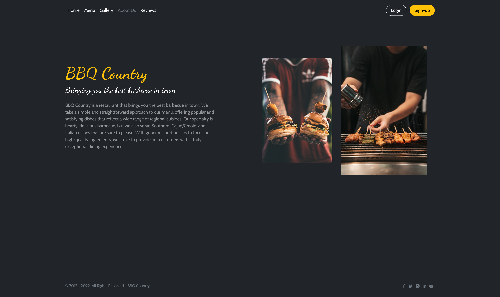

# BBQ Country

BBQ Country is a restaurant offering the best barbecue in town. Our menu features a wide variety of mouthwatering dishes, including pulled pork, ribs, 
burgers and chicken on variety of ways. We also offer sides and desserts to satisfy any craving.

## Project Description
BBQ Country is a restaurant website that showcases the mouth-watering barbecue dishes available at our restaurant. The site features a main page with a brief overview of our restaurant, a menu page where users can browse through our delicious dishes, and a gallery page where users can see photos of our restaurant and food.

Users can log in and book a date and time to dine at our restaurant. The website has been tested on various operating systems and browsers to ensure compatibility and a seamless user experience.


### View the live preview [here](https://bbq-country.herokuapp.com/)
(NOTE: Hold Ctrl and click the link to open in new tab)

## Table of content: 
 - [Technologies Used](#Technologies-Used)
 - [Look and Color Scheme](#Look-and-Color-Scheme)
 - [Features](#Features)
    * [Overview](#Overview)
    * [Main Page](#Main-Page)
    * [Menu](#Menu)
    * [Gallery](#Gallery)
    * [About Us](#About-Us)
    * [Reviews](#Reviews)
    * [Booking Form](#Booking-Form)
    * [Reservations](#Reservations)
    * [Sign in and Sign out](#Sign-in-and-Sign-out)
    * [Admin Panel](#Admin-Panel)
 - [Testing and Validation](#Testing-and-Validation)
   * [OS and Browser Tests](#OS-and-Browser-Tests)
   * [Unit Testing](#Unit-Testing)
   * [Validation](#Validation)
   * [Running Automated Tests](#Running-Automated-Tests)
 - [Deployment](#Deployment)
    * [Local Machine](#Local-Machine)
    * [Heroku](#Heroku)
 - [Attributions](#Attributions)

## Look and Color Scheme
Website has a minimalist design with a dark charcoal gray color scheme, which gives it a sleek and modern look. The buttons and headers are highlighted in a bold yellow color, evoking the warmth and vibrancy of embers, which perfectly fits the barbecue theme. By combining these colors and design elements, aim is to create an inviting and enjoyable online experience for customers.

## Technologies Used

### Core Technologies
This project is built with the following technologies:

* [Django](https://www.djangoproject.com/) 4.1.3 - A web framework for Python
* [Bootstrap](https://getbootstrap.com/) 5.1.3 - A CSS framework for styling and layout
* [CSS Grid](https://developer.mozilla.org/en-US/docs/Web/CSS/CSS_Grid_Layout) - A layout system for building responsive and flexible web pages
* [PostgreSQL](https://www.postgresql.org/) - Database Engine

### Libraries
[Starability](https://github.com/LunarLogic/starability) - Star rating library in pure HTML and CSS

[Django Phone Number Field](https://pypi.org/project/django-phonenumber-field/) - A Django library which interfaces with python-phonenumbers to validate, pretty print and convert phone numbers. python-phonenumbers is a port of Google’s libphonenumber library, which powers Android’s phone number handling.

[Bootstrap Datepicker](https://bootstrap-datepicker.readthedocs.io/en/latest/) - Bootstrap-datepicker provides a flexible datepicker widget in the Bootstrap style.

[jQuery Timepicker](https://timepicker.co/) - jQuery Timepicker can parse the most used time representations allowing you and your users to enter time using their prefered way for writing it.


## Features

### Overview
* A main page with a brief overview of our restaurant.
* A menu page where users can browse through our dishes.
* A gallery page with photos of our restaurant and food.
* About us page with short description of restaurant style and dishes.
* User login and booking system for making, updating or deleting the reservations.
* Reviews page where users can post a review with a rating and see other reviews.

### Main Page
The main page of the website features a minimalist design with a high-resolution background and a few (cheesy) slogans. The header will display different options depending on whether the user is authenticated or not, with a logout button that shows the active username.


### Menu
The menu page showcases the delicious barbecue dishes on offer. Each dish is represented by a beautiful image, such as pulled pork, ribs, and chicken, accompanied by a title. I have deliberately kept the design clean and simple by omitting pricing and descriptions, but it would be easy to add this information to each dish card if needed.


### Gallery
In keeping with the minimalist website style, the gallery page showcases photos of delicious food and inviting restaurant atmosphere. The page features a carousel of full-screen images that allow customers to fully appreciate the dishes and the ambiance of a restaurant.


### About Us
This page gives the customers an idea of who we are, what we offer, and what sets us apart from other barbecue restaurants. It helps the customers learn more about the restaurant and connect with the brand.



### Reviews
The Reviews page of the website allows authenticated users to leave their own review of the restaurant. They can also view reviews left by other users, which are displayed in ascending order. Each review includes the username and timestamp of the user who left it, as well as a star rating using the starability CSS library. The reviews provide valuable feedback for the restaurant, and allow customers to see what others think of our food, service, and atmosphere. The 1500 character limit on reviews ensures that they are concise and to the point.


### Booking Form
Booking page allows authenticated users to easily make a reservation at a restaurant. The page features a form with required fields that check the validity of the information entered, such as the email and phone number. The date picker on the form includes defensive coding to prevent users from selecting a date in the past, and the time picker offers a range of predefined working times. The number of people field requires a minimum of 1 and can only be a number, ensuring that the information entered is accurate and complete. Upon submission, the form will show the user a success or failure message, depending on the outcome of the booking.


### Reservations
In addition to being able to view their reservations, authenticated users on the website can also make updates or cancel them altogether. Each reservation entry on the page has an Edit and Delete button, allowing the user to easily manage their bookings. The Edit button will redirect the user to the main booking form, where they can modify the information for their reservation. The Delete button will delete the reservation from the database. Upon successful completion of these actions, the user will be shown a success or failure message.


### Sign in and Sign out
The Sign In and Sign Out forms will display success or failure messages to the user, depending on the outcome of the action. This provides feedback to the user, letting them know whether their sign in or sign out was successful, and why if it was not. This design helps to improve the user experience and ensure that customers can easily and securely manage their accounts on the website.


### Admin Panel
The admin panel allows the admin to view, update, and delete all reservations and reviews. This gives the admin full control over the information on the website, allowing them to manage and maintain the accuracy and completeness of the data. The admin can also add or remove users, or change their details, allowing them to manage the user accounts on the website. This design provides the admin with the tools they need to effectively manage the website and ensure that it provides a valuable service to customers.


## Testing and Validation

### OS and Browser tests
This project has been tested on the following operating systems and browsers:

* Windows 10 
   - Chrome ver.108.0.5359.98
   - Firefox ver.107.0.1
* Fedora Silverblue Linux 
   - Chrome ver.108.0.5359.98
   - Firefox ver.107.0.1
* iPad OS on iPad Air 
   - Safari ver.16.1
* Android
   - Vivaldi ver.5.5.2805.50

### Unit Testing
Unit tests are located in the restaurant/test repo folder. These tests cover the following features:

#### Unauthenticated test:

* Test GET method on unauthenticated views - pages that should load correctly 
   - Index 
   - Menu 
   - Gallery 
   - Reviews

* Test GET method on unauthenticated views - pages that should redirect to login form 
   - Booking 
   - My Reservations
   - Add Review

#### Sign up form test:
* Test signup form status code
* Test signup form create user - valid
* Test signup form missing username - invalid
* Test signup form miss-matching passwords - invalid
* Test signup form missing password - invalid

#### Log in form
* login form status code
* login form with valid user
* login form with invalid user

#### Booking form
* Test booking form for unauthenticated user, user should be redirected to login page
* Test booking form for authenticated user
* Test booking form with valid data, user should be redirected to my_reservations page after successful booking

<br>

Unit tests were run on in-memory SQLite DB


### Validation
The website has been tested for HTML and PEP8 validation.


#### PEP8
[CI PEP8 Validator](https://pep8ci.herokuapp.com/#) - Code institute validator

Site is 99.9% PEP8 compilant - it only failed in 2 instances on "line too long" but trying to split the line 
brakes the code so I left it like that.

First instance:


Second instance:


#### HTML
[W3 HTML Validator](https://validator.w3.org/nu/) - W3 HTML Online Validator

Site passes 100% on HTML Validation


### Running Automated Tests
To run the automated tests for this project, run the following command:
<br>

```
python manage.py test
```

## Deployment

### Local Machine

To deploy this project on your own server/local machine, follow these steps:

1. Install Python and PostgreSQL on your server.
2. Clone the repository from GitHub:

```
git clone https://github.com/Azelliott/bbq-country.git
```

3. Install the project dependencies:
```
cd bbq-country
pip install -r requirements.txt
```


4. Set up the database and create a superuser:
```
python manage.py migrate
python manage.py createsuperuser
```

5. Start the server:
```
python manage.py runserver
```

6. Open a web browser and go to `http://localhost:8000` to access the website.

### Heroku
1. Create a new Heroku app and a database ( DB can be a separate service )
2. Connect the app to the GitHub repository

3. Create env.py file and set up config vars:

```
SECRET_KEY: secret key for Django

DEBUG: set to False in production

ALLOWED_HOSTS: hostname of the Heroku app

DATABASE_URL: URL of the PostgreSQL database

```


## Attributions

Site images found on [Unsplash](https://unsplash.com/)